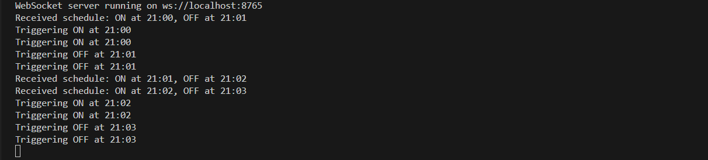
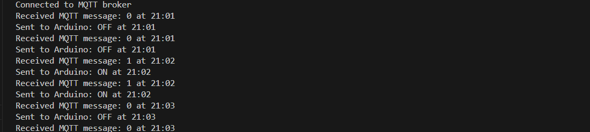

## IoT Light Scheduler

This project implements a **web-based light scheduling system** using **WebSocket** and **MQTT**
## Features

- Graphical light scheduler UI (Tailwind CSS)
- Arduino UNO + Relay integration for controlling light
- Real-time schedule updates via WebSocket
- MQTT used to broadcast light scheduling events

---

## Screenshots

## 1. UI


## 2. Server Logs



## 3. Subscriber Logs



## Setup Instructions

### 1. Arduino Hardware Setup

- **Wiring**:

  - Connect the **relay module** to **Arduino UNO**:
    - `VCC` → `5V`
    - `GND` → `GND`
    - `IN` → `Pin 8`
  - **Light wiring**:
    - Live wire goes between `COM` and `NO` on the relay module (insulate properly for safety).

- **Upload this Arduino sketch**:

```cpp
int relayPin = 8;

void setup() {
  Serial.begin(9600);
  pinMode(relayPin, OUTPUT);
  digitalWrite(relayPin, HIGH); // Relay OFF initially
}

void loop() {
  if (Serial.available() > 0) {
    String cmd = Serial.readStringUntil('\n');
    cmd.trim();
    if (cmd == "ON") {
      digitalWrite(relayPin, LOW); // Relay ON
    } else if (cmd == "OFF") {
      digitalWrite(relayPin, HIGH); // Relay OFF
    }
  }
}

## 2. Web Server Setup

Make sure you have a **WebSocket server** running that:

- Receives form submissions (`On Time` / `Off Time`)
- Sends appropriate commands (`ON` / `OFF`) to the Arduino via **Serial** or **MQTT**

> ⚙The frontend uses **Tailwind CSS** for modern styling and is fully mobile-responsive.

---

## How It Works

1. Users schedule light **ON/OFF** times via the web form.
2. The schedule is sent to a **WebSocket server**.
3. At the specified time, the server sends `ON` or `OFF` to the Arduino.
4. The Arduino controls a light using the **relay module**.

---

## Technologies Used

- HTML + Tailwind CSS
- WebSocket
- MQTT (e.g., Mosquitto)
- Arduino UNO + Relay
- JavaScript *(optional for frontend logic)*
```
